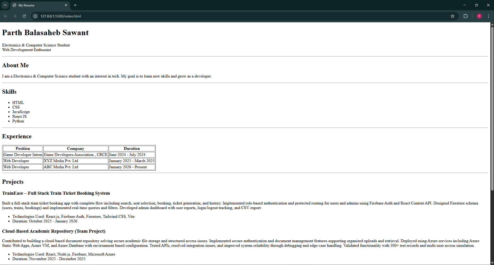
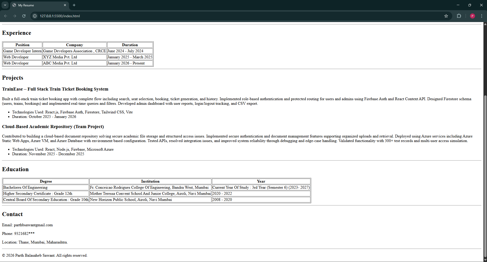

# Resume Website

This is a simple single-page resume website created using basic HTML.
This project is done by Parth Balasaheb Sawant.

## About the Project
The website contains basic resume sections like:
- Name and header
- About me
- Skills
- Experience
- Projects
- Education
- Contact details

No CSS or JavaScript is used in this project.

## Technologies Used
- HTML

## How to Run the Project
1. Download or clone the repository
2. Open the file named `index.html`
3. The resume will open in your web browser

## Screenshots
 

## Author
Parth Balasaheb Sawant